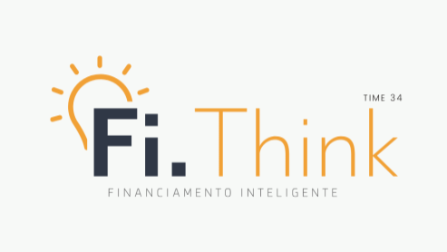

<h1 align="center">
    
</h1>

<h4 align="center"> 
	:heavy_check_mark: Fi.Think - TecBan :heavy_check_mark:
</h4>
<p align="center">	
  
  
  
  

  <a href="https://github.com/jpsoarxs/TecBan/commits/master">
    
  </a>

  

   <a href="https://github.com/jpsoarxs/TecBan/stargazers">
    
  </a>

</p>

<p align="center">
  <a href="#TecBan">TecBan</a>&nbsp;&nbsp;&nbsp;|&nbsp;&nbsp;&nbsp;
  <a href="#-project">Project</a>&nbsp;&nbsp;&nbsp;|&nbsp;&nbsp;&nbsp;
  <a href="#rocket-Technologies">Technologies</a>&nbsp;&nbsp;&nbsp;|&nbsp;&nbsp;&nbsp;
  <a href="#-how-to-use">How to use</a>&nbsp;&nbsp;&nbsp;|&nbsp;&nbsp;&nbsp;
  <a href="#memo-license">License</a>
</p>

## :information_source: What's Hackthon TecBan?

É uma iniciativa da TecBan que visa disseminar e educar as pessoas quanto as possibilidades que conectam o mundo físico ao mundo digital. Nesta edição, a companhia busca soluções que unam criatividade aos dados e transações disponíveis no Open Banking.

## 💻 Project

Descrição do projeto

<h1 align="center">
    
</h1>


## :rocket: Technologies

This project was developed with the following technologies:

- [Node.js][nodejs]
- [TypeScript][typescript]
- [React Native][rn]

## :information_source: How To Use

To clone and run this application, you'll need [Git](https://git-scm.com), [Node.js][nodejs] + [Yarn][yarn] installed on your computer.

From your command line:

### Run API 

```bash
# Clone this repository
$ git clone https://github.com/jpsoarxs/TecBan.git

# Go into the repository
$ cd TecBan/backend

# Install dependencies
$ yarn install
or
$ yarn

# Config .env
rename .env.example to .env and edit

# Config certificates
select a bank account and paste folder "certs" in "src"

# Start in watch mode
$ yarn dev

# running default port 3000
```

## :memo: License

This project is under the MIT license. See the [LICENSE](https://github.com/DanielObara/NLW-1.0/blob/master/LICENSE) for details.

[nodejs]: https://nodejs.org/
[typescript]: https://www.typescriptlang.org/
[rn]: https://facebook.github.io/react-native/
[yarn]: https://yarnpkg.com/
